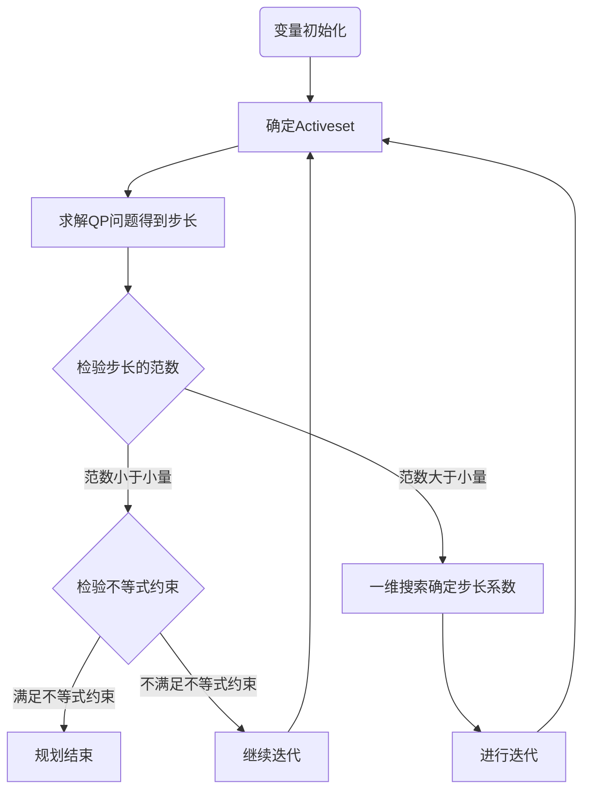

<script type="text/x-mathjax-config">
  MathJax.Hub.Config({
    tex2jax: {
      inlineMath: [ ['$','$'], ["\\(","\\)"] ],
      processEscapes: true
    }
  });
</script>
<script src="https://cdn.mathjax.org/mathjax/latest/MathJax.js?config=TeX-AMS-MML_HTMLorMML" type="text/javascript"></script>

# 理论部分
## Background

$$
\begin{aligned}
	\min\ &f(\boldsymbol{x})\\
	s.t.\ &h_i(\boldsymbol{x})=0,\ \ i\in E\\
	      &g_i(\boldsymbol{x})\leq0,\ \ i\in I\\
\end{aligned}\\
E和I分别是等式约束的指标集和不等式约束的指标集,c_i是约束函数
$$

-----

## Active Set

**如何处理不等号约束？**

$activeset$：一堆$active$（起到约束效果的）条件集合
$$
g_i(\boldsymbol{x}_k)\geq0 \Longrightarrow g_i^*(\boldsymbol{x}_{k+1})=0，视为active约束
$$
把从约束条件集合中拿出来的$active$约束条件加入工作集，等号约束条件始终在工作集内，这个集合是随着迭代不断变化的。求解在当前工作集下的约束QP问题来确定下一步迭代的方向。

----

## KKT & Lagrangian

构造$Lagrangian$函数（其中$g^*$表示$active$不等号约束条件）如下：
$$
\begin{aligned}			&L(\boldsymbol{x},\boldsymbol{\lambda},\boldsymbol{\mu})=f(\boldsymbol{x})+\boldsymbol{\lambda}^T \boldsymbol{h}(\boldsymbol{x})+\boldsymbol{\mu}^T \boldsymbol{g}^*(\boldsymbol{x})\\
	\\
	\Longrightarrow&目标 \ \nabla L= \left[\begin{array}{ccc}
	\frac{dL}{dx_i} \\
	\frac{dL}{d\lambda_i} \\
	\frac{dL}{d\mu_i} \\
	\end{array}\right]
	=\left[\begin{array}{ccc}
	\nabla f+\boldsymbol{\lambda}^T \nabla \boldsymbol{h}+\boldsymbol{\mu}^T\nabla \boldsymbol{g}^* \\
	h_i \\
	g_i^*\\
	\end{array}\right]=\boldsymbol{O} \\
\end{aligned}
$$

假设目标函数及约束函数皆为 凸函数，那么满足以上条件的点是一全局极小值。

----

## Newton's method in optimization

[维基百科](https://zh.wikipedia.org/wiki/%E6%87%89%E7%94%A8%E6%96%BC%E6%9C%80%E5%84%AA%E5%8C%96%E7%9A%84%E7%89%9B%E9%A0%93%E6%B3%95)
$$
\begin{aligned}
	f(x)&=f(x_k+\Delta x)\\
	&\approx f(x_k)+f'(x_k)\Delta x+\frac{1}{2}f''(x_k)\Delta x^2\\
	&令导数为0，即\Delta x=-\frac{f'(x_k)}{f''(x_k)}\\
	&x_{k+1}=x_k-\frac{f'(x_k)}{f''(x_k)}\\
\end{aligned}
$$
直至满足一定条件（如$f'(x_k)=0$或$x_{k+1}-x_k<\varepsilon$，其中$\varepsilon$为一个给定的足够小的常量）后算法终止。


推广至高维，只需将导数替换为梯度$\nabla f(x)$，并将二阶导数的导数替换为$Hessian$矩阵的逆矩阵$[Hf(x)]^{-1}$
$$
x_{k+1}=x_k-[Hf(x_k)]^{-1}\nabla f(x_k)\\
$$


-----

## SQP Algorithm

$$
\begin{aligned}
	\min\ &f(\boldsymbol{x}_k)+\nabla f(\boldsymbol{x}_k)^T\boldsymbol{d}_k+\frac{1}{2}\boldsymbol{d}_k^T\nabla^2f(\boldsymbol{x}_k)\boldsymbol{d}_k\\
	s.t.\ &h(\boldsymbol{x}_k)+\nabla h(\boldsymbol{x}_k)^T\boldsymbol{d}_k=0\\
	&g^*(\boldsymbol{x}_k)+\nabla g^*(\boldsymbol{x}_k)^T\boldsymbol{d}_k=0\\
\end{aligned}
$$

$$
\Longrightarrow
\left\{
\begin{array}{ll}
	\min&f(\boldsymbol{x}_k)+\nabla f(\boldsymbol{x}_k)^T\boldsymbol{d}_k+\frac{1}{2}\boldsymbol{d}_k^T\nabla^2f(\boldsymbol{x}_k)\boldsymbol{d}_k\\
	&+\sum\limits_{i\in E}\lambda_i\left[h_i(\boldsymbol{x}_k)+\nabla h_i(\boldsymbol{x}_k)^T\boldsymbol{d}_k\right]+\sum\limits_{i\in I}\mu_i \left[g_i^*(\boldsymbol{x}_k)+\nabla g_i^*(\boldsymbol{x}_k)^T\boldsymbol{d}_k\right]\\
	&h_i(\boldsymbol{x}_k)+\nabla h_i(\boldsymbol{x}_k)^T\boldsymbol{d}_k=0\\
	&g_i^*(\boldsymbol{x}_k)+\nabla g_i^*(\boldsymbol{x}_k)^T\boldsymbol{d}_k=0\\
\end{array}
\right.
$$

$$
\Longrightarrow
\left\{
\begin{array}{ll}
	&\nabla f(\boldsymbol{x}_k)+\nabla^2f(\boldsymbol{x}_k)\boldsymbol{d}_k+\sum\limits_{i\in E}\lambda_i \nabla h_i(\boldsymbol{x})+\sum\limits_{i\in I}\mu_i \nabla g_i^*(\boldsymbol{x})=0\\
	&h_i(\boldsymbol{x}_k)+\nabla h_i(\boldsymbol{x}_k)^T\boldsymbol{d}_k=0\\
	&g_i^*(\boldsymbol{x}_k)+\nabla g_i^*(\boldsymbol{x}_k)^T\boldsymbol{d}_k=0\\
\end{array}
\right.
$$

$$
\Longrightarrow
\left[
\matrix{
  H[\nabla^2f(\boldsymbol{x}_k)] & \nabla \boldsymbol{h}(\boldsymbol{x}) & \nabla \boldsymbol{g}^*(\boldsymbol{x})\\
  \nabla \boldsymbol{h}(\boldsymbol{x})^T & \boldsymbol{O} & \boldsymbol{O}\\
  \nabla \boldsymbol{g}^*(\boldsymbol{x})^T & \boldsymbol{O} & \boldsymbol{O}\\ 
}
\right]
\left[
\matrix{
  \boldsymbol{d}_k \\
  \boldsymbol{\lambda} \\
  \boldsymbol{\mu} \\ 
}
\right]
=
\left[
\matrix{
  -\nabla f(\boldsymbol{x}_k) \\
  -\boldsymbol{h}(\boldsymbol{x}_k) \\
  -\boldsymbol{g}^*(\boldsymbol{x}_k) \\ 
}
\right]
$$

$$
\Longrightarrow\boldsymbol{x}_{k+1}=\boldsymbol{x}_k+\boldsymbol{d}_k
$$

（其中$g^*$表示$active$不等号约束条件，$\boldsymbol{d}_k$表示当前迭代的步长向量）

----

## Line search

牛顿法能使得更新后函数处于极值点，但是它不一定是极小点，也就是说牛顿方向可能是下降方向，也可能是上升方向，以至于当初始点远离极小点时，牛顿法有可能不收敛。因此提出**阻尼牛顿法**，在牛顿法的基础上，每次迭代除了计算更新方向，还要对最优步长做一维搜索。
$$
\begin{aligned}
	\boldsymbol{x}_{k+1}&=\boldsymbol{x}_k-\gamma[Hf(x_k)]^{-1}\nabla f(x_k)\\
	即\boldsymbol{x}_{k+1}&=\boldsymbol{x}_k+\boldsymbol{\alpha}_k\boldsymbol{d}_k
\end{aligned}
$$
### 精确一维搜索

#### 直接方法

1. $0.618$法
2. $Fibonacci$法

#### 插值法

1. 二次插值法
   1. 一点二次插值法（牛顿法）：收敛效果并不佳
   2. 二点二次插值法
2. 三次插值法

### 不精确一维搜索

#### Armijo-Goldstein准则

$$
f(x_k+\alpha_k d_k)<f(x_k)+\rho g^T_k\alpha_kd_k
$$

#### Wolfe-Powell准则

$$
g^T_{k+1}d_k\geq \sigma g^T_kd_k\\
|g^T_{k+1}d_k|\leq \sigma|g^T_kd_k|
$$

----

## Modified Newton method

牛顿法面临的主要困难是$Hessian$矩阵$G_k$不正定。这时候二次模型不一定有极小点，甚至没有平稳点。当$G_k$不正定时，二次模型函数是无界的。

### Goldstein-Price修正法

当$Hessian$不正定时， 采用最速下降方向。
$$
d_k=\left\{  
             \begin{array}{**lr**}  
             d_k^N,\ \ if\ \cos\langle d_k^N,-g\rangle\geq \eta\\
             -g_k,\ \ otherwise
             \end{array}  
\right.
$$


### Goldfeld修正法

使牛顿方向偏向最速下降方向将$Hessian$矩阵$G_k$改变为$G_k+v_k I$。比较理想的是，$v_k$不要太大于使$G_k+v_k I$正定的最小的$v$。


[Gerschgorin（盖尔）圆盘定理](https://zhuanlan.zhihu.com/p/31463121)
$$
\begin{aligned}
	b_1&=|\min\limits_{1\leq i\leq n}\{(G_k)_{ii}-\sum_{j\not=i}|(G_k)_{ij}|\}|\geq|\min\limits_{i}\lambda_i|\\
	b_2&=\max_{i}\{e_{ii} \}，其中e_{ii}是E的第i个对角元\\
	v_k&=\min\{b_1,b_2 \}\\
\end{aligned}
$$

### 基于Cholesky分解的修正法

[维基百科](https://zh.wikipedia.org/wiki/Cholesky%E5%88%86%E8%A7%A3)

先形成$G_k$的$Cholesky$分解$LDL^T$，然后定义$\overline{G_k}=L\overline{D}L^T$，其中$\overline{d_{ii}}=\max\{|d_{jj}|,\delta\}$，$d_{jj}$为$D$的对角元，$\delta$是某个给定的小正数。

**缺陷**

1. 对称不定矩阵的 Cholesky分解可能不存在。
2. 即使这种分解存在，其计算过程一般也是数值不稳定的，因为其矩阵分解因子的元素可能是无界的。进一步，当$G_k$仅是稍微不定的，用这样的方法产生的$G_k$也可能与$G_k$相差很大。

### Gill&Murry修正法（数值稳定）

----

## 拟牛顿法（BFGS Algorithm）

[维基百科](https://zh.wikipedia.org/wiki/%E6%93%AC%E7%89%9B%E9%A0%93%E6%B3%95)

求一个高维问题的 Hessian矩阵的逆矩阵是一件颇费工夫的事情。

割线方程组，对Hessian矩阵进行近似

----

# 实现及优化

## Introduction

以$Wiki$上的例子为对象进行尝试
$$
\begin{aligned}
	\min\ f(\boldsymbol{x})&=-sin(u+v)\\
	             s.t.\ -u-v&\leq0\\
	               u+v-\pi &\leq 0\\
	                      u&=v^3\\
\end{aligned}
$$

## Flow chart




## Code(Python)

### BFGS

```python
from numpy import *
import math
from sympy import *
import itertools
import time
from tqdm import *

variable = symbols('u v lambda1 mu1 mu2')
# 目标函数
f = - sin(variable[0] + variable[1]) + variable[2]*(variable[0] - variable[1]**3)
# 不等号约束
g = {}
g[0] = - variable[0] - variable[1]
g[1] = variable[0] + variable[1] - pi
mug = {}
mug[0] = variable[3]*(- variable[0] - variable[1])
mug[1] = variable[4]*(variable[0] + variable[1] - pi)
activeset = [0]*2
constraints = ['mu1', 'mu2']
n = 3

def SQP(fun, nIters, x):
    # 初始化
    xk = Matrix([random.random() for i in range(len(x))])
    gradient = Matrix([diff(fun,x_i) for x_i in x])
    H = eye(len(x))
    gradientX = einsetzen(gradient, x, xk)

    for k in trange(nIters):

        # 计算下一个x
        p = - H.inv() * gradientX
        alpha = linesearch(fun, p, xk, gradientX, x)
        # print("alpha = ", alpha)
        xkNext = xk + alpha*p
        if xkNext == xk:
            return xk

        # 拟牛顿法 BFGS 计算下一个Hessian矩阵
        s = xkNext - xk
        gradientXNext = einsetzen(gradient, x, xkNext)
        y =  gradientXNext - gradientX
        Hs = H*s
        H = H + (y*y.T) / (y.T*s)[0]  -  Hs*Hs.T / (s.T*Hs)[0]

        # 为下一次迭代做准备
        gradientX = gradientXNext
        xk = xkNext.evalf()
        H = H.evalf()
    return xk

# 一维线搜索
def linesearch(fun, p, xk, gradientX, x):
    c = 0.1
    alpha = 1
    linearFactor = c*(gradientX.T*p)[0] # [0]转化为标量
    linear = einsetzen(fun, x, xk) + linearFactor
    for i in range(5):
        new = einsetzen(fun, x, xk + alpha*p)
        if new <= linear:
            return alpha 
        else:
            alpha /= 2
    return alpha

# 数值计算
def einsetzen(fun, x, vec):
    return fun.subs(list(zip(x, vec)))


def run(nIters):
    # 初始化
    x = symbols('u v lambda1')
    fun = f
    start_time = time.time()
    flag = 1

    # Activeset
    while flag > 0:
        flag = 0
        x_new = ['u', 'v', 'lambda1']
        result = SQP(fun, nIters, x)
        print(result, einsetzen(fun, x, result))
        for i in range(len(activeset)):
            j = 0
            if activeset[i] == 0:
                if einsetzen(g[i], x, result) > 0:
                    activeset[i] = 1
                    fun = fun + mug[i]
                    flag += 1
                    x_new.append(constraints[i])
            else:
                if result[j + n] < 0:
                    activeset[i] = 0
                    fun = fun - mug[i]
                    flag += 1
                j += 1
        del x
        x = symbols(x_new)
        print('x = ', x)
    
    print(result)
    print(einsetzen(f, x, result))
    print("用时共计", time.time() - start_time, "seconds\n")

# 预设10次迭代
run(10)
```

### Hessian

```python
from numpy import *
import math
from sympy import *
import itertools
import time
from tqdm import *

variable = symbols('u v lambda1 mu1 mu2')
# 目标函数
f = - sin(variable[0] + variable[1]) + variable[2]*(variable[0] - variable[1]**3)
# 不等号约束
g = {}
g[0] = - variable[0] - variable[1]
g[1] = variable[0] + variable[1] - pi
mug = {}
mug[0] = variable[3]*(- variable[0] - variable[1])
mug[1] = variable[4]*(variable[0] + variable[1] - pi)
activeset = [0]*2
constraints = ['mu1', 'mu2']
n = 3       # 不计入Activeset的变量数目

def SQP(fun, nIters, x):
    # 预处理
    flag_time = time.time()
    size_L = len(x)
    xk = Matrix([random.random() for i in range(size_L)])
    # 计算gradient和Hessian矩阵的函数形式
    gradient = Matrix([diff(fun,x_i) for x_i in x])
    H = eye(len(x))
    Hessian = list()
    for i in range(size_L):
        for j in range(size_L):
            Hessian.append(diff(gradient[i], x[j]))
    print('初始化', time.time() - flag_time)
    flag_time = time.time()
    # 开始迭代
    for k in range(nIters):
        gradientX = einsetzen(gradient, x, xk)
        print('gradient', time.time() - flag_time)
        flag_time = time.time()
        count = 0
        for i in range(size_L):
            for j in range(size_L):
                H[i, j] = einsetzen(Hessian[count], x, xk)
                count += 1
        print('Hessian', time.time() - flag_time)
        flag_time = time.time()
        # QP
        p = - H.inv() * gradientX
        print('步长', time.time() - flag_time)
        flag_time = time.time()
        xkNext = xk + p
        if xkNext == xk:
            return xk
        xk = xkNext
    return xk

# 数值计算
def einsetzen(fun, x, vec):
    return fun.subs(list(zip(x, vec)))


def run(nIters):
    # 初始化
    x = symbols('u v lambda1')
    fun = f
    start_time = time.time()
    flag = 1

    # Activeset
    while flag > 0:
        flag = 0
        x_new = ['u', 'v', 'lambda1']
        result = SQP(fun, nIters, x)
        print(result, einsetzen(fun, x, result))
        for i in range(len(activeset)):
            j = 0
            if activeset[i] == 0:
                if einsetzen(g[i], x, result) > 0:
                    activeset[i] = 1
                    fun = fun + mug[i]
                    flag += 1
                    x_new.append(constraints[i])
            else:
                if result[j + n] < 0:
                    activeset[i] = 0
                    fun = fun - mug[i]
                    flag += 1
                j += 1
        del x
        x = symbols(x_new)
        print('x_new = ', x_new)
        print('x = ', x)
    print(result)
    print(einsetzen(f, x, result))
    print("Took", time.time() - start_time, "seconds\n")


run(5)
```

----

## Code(C++)
### 解析法

```c++
#include <iostream>
#include <stdio.h>
#include <cstdlib>
#include <cstring>
#include <cmath>
#include <math.h>
#include <iomanip>
#include<time.h>
#include <Eigen/Dense>

using namespace Eigen;
using namespace std;

//User define
#define pi 3.14159265359  //Pi的精度
int var_num = 2;          //目标函数变量个数
int ec_num = 1;           //等号约束个数
int ic_num = 2;           //不等号约束个数
int repeat = 1;           //主程序循环次数
double rand_range = 1e+5; //初始随机值范围
double epsilon1 = 1e-10;  //Hessian行列式容忍限度
double epsilon2 = 1e-10;  //不等号约束激活条件
double epsilon3 = 1e-10;  //步长下限
double epsilon4 = 1e-15;  //迭代停止下限

//目标函数
inline double f(double x[]) {
	return -sin(x[0] + x[1]);
}
inline double df0(double x[]) {
	return -cos(x[0] + x[1]);
}
inline double df1(double x[]) {
	return -cos(x[0] + x[1]);
}
inline double Qdf00(double x[]) {
	return sin(x[0] + x[1]);
}
inline double Qdf01(double x[]) {
	return sin(x[0] + x[1]);
}
inline double Qdf10(double x[]) {
	return sin(x[0] + x[1]);
}
inline double Qdf11(double x[]) {
	return sin(x[0] + x[1]);
}
//等号约束
inline double h0(double x[]) {
	return x[0] - pow(x[1], 3);
}
inline double dh0(double x[]) {
	return 1;
}
inline double dh1(double x[]) {
	return -3 * pow(x[1], 2);
}
//不等号约束
inline double g0(double x[]) {
	return -x[0] - x[1];
}
inline double g1(double x[]) {
	return x[0] + x[1] - pi;
}
inline double dg00(double x[]) {
	return -1;
}
inline double dg01(double x[]) {
	return -1;
}
inline double dg10(double x[]) {
	return 1;
}
inline double dg11(double x[]) {
	return 1;
}
//定义函数数组
double (*h[])(double x[]) = { h0 };
double (*g[])(double x[]) = { g0, g1 };
double (*df[])(double x[]) = { df0, df1 };
double (*dh[])(double x[]) = { dh0, dh1 };
double (*dg[])(double x[]) = { dg00, dg01, dg10, dg11 };
double (*Qdf[])(double x[]) = { Qdf00, Qdf01, Qdf10, Qdf11 };


//System define
int c_num = ec_num + ic_num;
int awz_num = var_num + ec_num;
int total_num = var_num + ec_num + ic_num;
int active_num;

//gradient函数
MatrixXd Gradient(double x[], int activeset[]) {
	MatrixXd tmp(awz_num + active_num, 1);
	int count = 0;
	for (int i = 0; i < var_num; ++i) {
		tmp(count++, 0) = df[i](x);
	}
	for (int i = 0; i < ec_num; ++i) {
		tmp(count++, 0) = h[i](x);
	}
	for (int i = 0; i < ic_num; ++i) {
		if (activeset[awz_num + i] == 1) {
			tmp(count++, 0) = g[i](x);
		}
	}
	return tmp;
}
//Hessian矩阵函数
MatrixXd Hessian(double x[], int activeset[]) {
	int size = awz_num + active_num;
	MatrixXd tmp = MatrixXd::Zero(size, size);
	int count_x = 0;
	int count_y;
	for (int i = 0; i < total_num; ++i) {
		if (i < var_num) {
			count_y = 0;
			for (int j = 0; j < total_num; ++j) {
				if (j < var_num) {
					tmp(count_x, count_y++) = Qdf[i * var_num + j](x);
				}
				else {
					if (j < awz_num) {
						tmp(count_x, count_y++) = dh[i](x);
					}
					else {
						if (activeset[j] == 1) {
							tmp(count_x, count_y++) = dg[(j - awz_num) * var_num + i](x);
						}
					}
				}
			}
			++count_x;
		}
		else {
			if (i < awz_num) {
				count_y = 0;
				for (int j = 0; j < var_num; ++j) {
					tmp(count_x, count_y++) = dh[j](x);
				}
				++count_x;
			}
			else {
				if (activeset[i] == 1) {
					count_y = 0;
					for (int j = 0; j < var_num; ++j) {
						tmp(count_x, count_y++) = dg[(i - awz_num) * var_num + j](x);
					}
					++count_x;
				}
			}
		}
	}
	return tmp;
}
//伪逆矩阵函数
MatrixXd pinv(const MatrixXd obj)
{
	JacobiSVD< MatrixXd > svd(obj, ComputeThinU | ComputeThinV);
	MatrixXd S = svd.matrixU().inverse() * obj * svd.matrixV().transpose().inverse();
	return svd.matrixV() * S * svd.matrixU().transpose();
}
//一维范数
double norm(const MatrixXd obj)
{
	double tmp = 0;
	for (int i = 0; i < obj.rows(); ++i) {
		for (int j = 0; j < obj.cols(); ++j) {
			tmp += fabs(obj(i, j));
		}
	}
	return tmp;
}
//一维线搜索函数
double linesearch(MatrixXd gradient, MatrixXd delta, double x[], int activeset[]) {
	double alpha = 1;
	double tp = f(x);
	bool flag = true;
	double* tmp = new double[total_num];
	for (int i = 0; i < total_num; ++i) {
		tmp[i] = x[i];
	}
	while (alpha != 0 && flag) {
		for (int i = 0; i < var_num; ++i) {
			tmp[i] = x[i] - alpha * gradient(i, 0);
		}
		if (f(tmp) > tp) {
			alpha /= 2;
		}
		else {
			flag = false;
		}
	}
	return alpha;
}
//QP子问题
MatrixXd SubQP(int activeset[], double x[]) {
	int size = awz_num + active_num;
	double alpha;
	MatrixXd gradient(size, 1);
	MatrixXd hessian(size, size);
	MatrixXd p(size, 1);
	gradient = Gradient(x, activeset);
	hessian = Hessian(x, activeset);
	if (fabs(hessian.determinant()) > epsilon1) {
		p = hessian.inverse() * gradient;
	}
	else {
		p = pinv(hessian) * gradient;
	}
	if (norm(p.block(0, 0, var_num, 1)) < epsilon3) {
		alpha = linesearch(gradient, gradient, x, activeset);
		return alpha * gradient;
	}
	else {
		alpha = linesearch(gradient, p, x, activeset);
		p *= alpha;
		return p;
	}
}

int main()
{
	clock_t start, end;
	srand((unsigned)time(NULL));
	start = clock();
	int* activeset = new int[total_num];
	bool flag = false;
	int min = 0;
	int count;
	double** x = new double* [repeat];
	for (int i = 0; i < repeat; ++i) {
		x[i] = new double[total_num];
	}
	for (int i = 0; i < awz_num; ++i) {
		activeset[i] = 1;
	}
	double* ans = new double[repeat];
	for (int n = 0; n < repeat; ++n) {
		for (int i = 0; i < var_num; ++i) {
			x[n][i] = rand() / double(RAND_MAX) * rand_range;
		}
		for (int i = var_num; i < total_num; ++i) {
			x[n][i] = rand() / double(RAND_MAX);
		}
		while (!flag) {
			//Activeset
			active_num = 0;
			for (int i = 0; i < ic_num; ++i) {
				if (g[i](x[n]) > -epsilon2) {
					activeset[awz_num + i] = 1;
					++active_num;
				}
				else {
					activeset[awz_num + i] = 0;
				}
			}
			flag = true;
			MatrixXd p = SubQP(activeset, x[n]);
			for (int i = 0; i < var_num; ++i) {
				if (fabs(p(i, 0)) > epsilon4) {
					flag = false;
				}
			}
			count = 0;
			for (int i = 0; i < var_num; ++i) {
				x[n][i] -= p(count++, 0);
			}
			for (int i = var_num; i < total_num; ++i) {
				if (activeset[i] == 1) {
					x[n][i] = -p(count++, 0);
				}
			}
			for (int i = 0; i < ic_num; ++i) {
				if (g[i](x[n]) > 0) {
					flag = false;
				}
			}
			cout << "变量当前为: ";
			for (int i = 0; i < var_num; ++i) {
				cout << x[n][i] << ' ';
			}
			cout << "  目标函数值为: " << f(x[n]);
			cout << "  等号约束误差: " << x[n][0] - pow(x[n][1], 3) << endl;
		}
		ans[n] = f(x[n]);
		if (ans[n] < ans[min]) {
			min = n;
		}
	}
	cout << "最终变量分别为: ";
	for (int i = 0; i < var_num; ++i) {
		cout << x[min][i] << ' ';
	}
	cout << endl << "规划结果为: " << ans[min] << endl;
	cout << "等号约束误差: " << x[min][0] - pow(x[min][1], 3) << endl;
	end = clock();
	cout << "程序运行时间: " << (double)(end - start) / CLOCKS_PER_SEC << 'sec';
	return 0;
}
```

### 数值法

```c++
#include <iostream>
#include <stdio.h>
#include <cstdlib>
#include <cstring>
#include <cmath>
#include <math.h>
#include <iomanip>
#include<time.h>
#include <Eigen/Dense>
#include <fstream>

using namespace Eigen;
using namespace std;

//User define
#define pi 3.14159265359  //Pi的精度
int var_num = 2;          //目标函数变量个数
int ec_num = 1;           //等号约束个数
int ic_num = 2;           //不等号约束个数
int repeat = 200;          //主程序循环次数
double rand_range = 1e+4; //初始随机值范围
double step = 1e-6;       //偏导精度
double epsilon1 = 1e-10;  //Hessian行列式容忍限度
double epsilon2 = 1e-5;   //不等号约束激活条件
double epsilon3 = 1e-5;   //步长下限
double epsilon4 = 1e-10;  //迭代停止下限

//目标函数
inline double f(double x[]) {
	return -sin(x[0] + x[1]);
}
//等号约束
inline double h0(double x[]) {
	return x[0] - pow(x[1], 3);
}
//不等号约束
inline double g0(double x[]) {
	return -x[0] - x[1];
}
inline double g1(double x[]) {
	return x[0] + x[1] - pi;
}
//定义函数数组
double (*h[])(double x[]) = { h0 };
double (*g[])(double x[]) = { g0, g1 };


//System define
int c_num = ec_num + ic_num;
int awz_num = var_num + ec_num;
int total_num = var_num + ec_num + ic_num;
int active_num;

//偏导及二阶偏导函数
double partial(int k, int l, double x[]) {
	double* tmp = new double[total_num];
	for (int i = 0; i < total_num; ++i) {
		tmp[i] = x[i];
	}
	tmp[l] += step;
	if (k == 0) {
		return (f(tmp) - f(x)) / step;
	}
	else {
		k -= 1;
		if (k < ec_num) {
			return (h[k](tmp) - h[k](x)) / step;
		}
		else {
			k -= ec_num;
			return (g[k](tmp) - g[k](x)) / step;
		}
	}
}
double Qpartial(int k, int l, double x[]) {
	double* tmp = new double[total_num];
	for (int i = 0; i < total_num; ++i) {
		tmp[i] = x[i];
	}
	tmp[l] += step;
	return (partial(0, k, tmp) - partial(0, k, x)) / step;
}
//gradient函数
MatrixXd Gradient(double x[], int activeset[]) {
	MatrixXd tmp(awz_num + active_num, 1);
	int count = 0;
	for (int i = 0; i < var_num; ++i) {
		tmp(count++, 0) = partial(0, i, x);
	}
	for (int i = 0; i < ec_num; ++i) {
		tmp(count++, 0) = h[i](x);
	}
	for (int i = 0; i < ic_num; ++i) {
		if (activeset[awz_num + i] == 1) {
			tmp(count++, 0) = g[i](x);
		}
	}
	return tmp;
}
//Hessian矩阵函数
MatrixXd Hessian(double x[], int activeset[]) {
	int size = awz_num + active_num;
	MatrixXd tmp = MatrixXd::Zero(size, size);
	int count_x = 0;
	int count_y;
	for (int i = 0; i < total_num; ++i) {
		if (i < var_num) {
			count_y = 0;
			for (int j = 0; j < total_num; ++j) {
				if (j < var_num) {
					tmp(count_x, count_y++) = Qpartial(i, j, x);
				}
				else {
					if (activeset[j] == 1) {
						tmp(count_x, count_y++) = partial(j - var_num + 1, i, x);
					}
				}
			}
			++count_x;
		}
		else {
			if (activeset[i] == 1) {
				count_y = 0;
				for (int j = 0; j < var_num; ++j) {
					tmp(count_x, count_y++) = partial(i - var_num + 1, j, x);
				}
				++count_x;
			}
		}
	}
	return tmp;
}
//伪逆矩阵函数
MatrixXd pinv(const MatrixXd obj)
{
	JacobiSVD< MatrixXd > svd(obj, ComputeThinU | ComputeThinV);
	MatrixXd S = svd.matrixU().inverse() * obj * svd.matrixV().transpose().inverse();
	return svd.matrixV() * S * svd.matrixU().transpose();
}
//一维范数
double norm(const MatrixXd obj)
{
	double tmp = 0;
	for (int i = 0; i < obj.rows(); ++i) {
		for (int j = 0; j < obj.cols(); ++j) {
			tmp += fabs(obj(i, j));
		}
	}
	return tmp;
}
//一维线搜索函数
double linesearch(MatrixXd gradient, MatrixXd delta, double x[], int activeset[]) {
	double alpha = 1;
	double tp = f(x);
	bool flag = true;
	double* tmp = new double[total_num];
	for (int i = 0; i < total_num; ++i) {
		tmp[i] = x[i];
	}
	while (alpha != 0 && flag) {
		for (int i = 0; i < var_num; ++i) {
			tmp[i] = x[i] - alpha * gradient(i, 0);
		}
		if (f(tmp) > tp) {
			alpha /= 2;
		}
		else {
			flag = false;
		}
	}
	return alpha;
}
//QP子问题
MatrixXd SubQP(int activeset[], double x[]) {
	int size = awz_num + active_num;
	double alpha;
	MatrixXd gradient(size, 1);
	MatrixXd hessian(size, size);
	MatrixXd p(size, 1);
	gradient = Gradient(x, activeset);
	hessian = Hessian(x, activeset);
	if (fabs(hessian.determinant()) > epsilon1) {
		p = hessian.inverse() * gradient;
	}
	else {
		p = pinv(hessian) * gradient;
	}
	if (norm(p.block(0, 0, var_num, 1)) < epsilon3) {
		alpha = linesearch(gradient, gradient, x, activeset);
		return alpha * gradient;
	}
	else {
		alpha = linesearch(gradient, p, x, activeset);
		p *= alpha;
		return p;
	}
}

int main()
{
	clock_t start, end;
	srand((unsigned)time(NULL));
	cout.setf(ios_base::showpoint);
	cout.precision(6);
	int* activeset = new int[total_num];
	bool flag;
	int min = 0;
	int count;
	double** x = new double* [repeat];
	double* time = new double[repeat];
	for (int i = 0; i < repeat; ++i) {
		x[i] = new double[total_num];
	}
	for (int i = 0; i < awz_num; ++i) {
		activeset[i] = 1;
	}
	double* ans = new double[repeat];
	for (int n = 0; n < repeat; ++n) {
		flag = false;
		start = clock();
		for (int i = 0; i < var_num; ++i) {
			x[n][i] = rand() / double(RAND_MAX) * rand_range;
		}
		for (int i = var_num; i < total_num; ++i) {
			x[n][i] = rand() / double(RAND_MAX);
		}
		while (!flag) {
			//Activeset
			active_num = 0;
			for (int i = 0; i < ic_num; ++i) {
				if (g[i](x[n]) > -epsilon2) {
					activeset[awz_num + i] = 1;
					++active_num;
				}
				else {
					activeset[awz_num + i] = 0;
				}
			}
			flag = true;
			MatrixXd p = SubQP(activeset, x[n]);
			for (int i = 0; i < var_num; ++i) {
				if (fabs(p(i, 0)) > epsilon4) {
					flag = false;
				}
			}
			count = 0;
			for (int i = 0; i < var_num; ++i) {
				x[n][i] -= p(count++, 0);
			}
			for (int i = var_num; i < total_num; ++i) {
				if (activeset[i] == 1) {
					x[n][i] = -p(count++, 0);
				}
			}
			for (int i = 0; i < ic_num; ++i) {
				if (g[i](x[n]) > 0) {
					flag = false;
				}
			}
			cout << "变量当前为: ";
			for (int i = 0; i < var_num; ++i) {
				cout << x[n][i] << ' ';
			}
			cout << "  目标函数值为: " << f(x[n]);
			cout << "  等号约束误差： " << x[n][0] - pow(x[n][1], 3) << endl;
		}
		ans[n] = f(x[n]);
		if (ans[n] < ans[min]) {
			min = n;
		}
		end = clock();
		time[n] = (double)(end - start) / CLOCKS_PER_SEC;
	}
	cout << endl << "最终变量分别为: ";
	for (int i = 0; i < var_num; ++i) {
		cout << x[min][i] << ' ';
	}
	cout << endl << "规划结果为: " << ans[min] << endl;
	cout << "等号约束误差： " << x[min][0] - pow(x[min][1], 3) << endl;
	ofstream myout("1.txt");
	for (int i = 0; i < repeat; ++i) {
		myout << time[i] << "\n";
	}
	myout.close();
	return 0;
}
```

