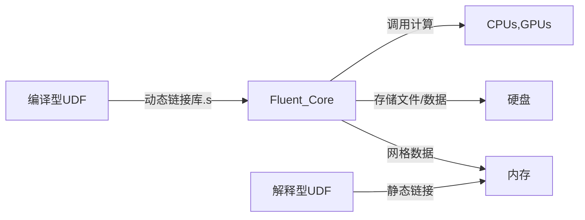
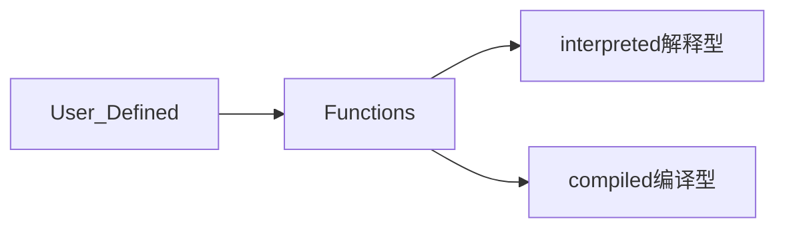
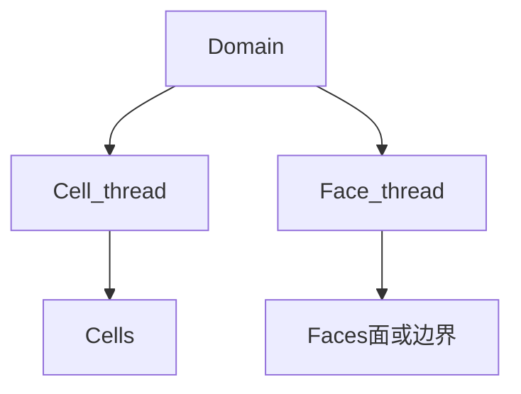

## 安装及使用

1. Microsoft账户名应为英文
2. Linux平台目前Ubuntu未受支持

## Geometry

1. SW作图后导入，推荐$x\_T$格式
2. 流体域抽取：
   1. Fills 内流域：By Cavity不需要流道封闭，而By Caps要求封闭
   2. Enclosure 外流域

## Mesh

注意Physics Preference的选择！

### 一些概念

- 网格：Grid Cell Mesh
- 节点：离散计算域的分割线的交点
  - Node 固体计算
  - Vertices 流体计算
- 控制体：control volume

### 详细设置

1. Quality->Mesh Metric中选择Element Quality
2. 创建边界命名
3. Inflation实现边界层网络

### 参数优先级

边->面->体->全局尺寸

## 静力学分析

选择分析系统（一般Static Structural）

### 开始分析
1. 材料确认
2. 网格划分 （Sizeing -> Element Size）
3. 添加约束
4. 进行分析

## 流体力学Setup
### 边界条件Setup

1. $Default\ domain$右击，$boundary$设置$inlet$入口，$outlet$出口，$opening$开放但未知流向，$wall$不可通过
2. 流动混乱程度设置

## Monitors

设置残差标准

### 求解Solution

$Run Mode$：$Serial$串行，$Parallel$并行（建议6Processes 1GPU）

### 结果Results

1. $Streamline$ 流速
2. $Contour$ 面上压力等数据

## FLUENT

### General

压力基求解器(Pressure-Based)适用于低速不可压缩流动，密度基求解器(Density-Based)适用于高速可压流动。

### 关于UDF(User Defined Functions)

### UDF语法及编写

链接UDF与FLUENT的关键：thread数据类型

- cell_t：单元整型数据类型
- face_t：面
- Domain
- Thread
- Node

## 使用快捷键

1. 平移 Ctrl+中键
2. 

## 注意点

1. 分析结果建议设置 true scale
2. 图例中的数值可以手动修改
3. 网格划分

